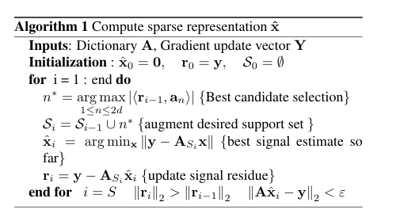

# sparseSGD

 <a href="https://drive.google.com/open?id=1DuXH-WistPTTfQFm48L_zBZy4CubDLeB">Report</a>

Stochastic Gradient Descent (SGD) is a widely used optimization technique for training deep neural networks. Though it is more faster and efficient that gradient descent, it still has relatively more computations to perform. In the paradigm of Federated or Distributed learning, computation cost is a huge factor as computation is done on light devices like mobile phones and tablets. To this end, we explore the idea of sparsified SGD so as to reduce the computations while also maintaining a good performance by doing sparsification of gradient updates in a calculated way. In this work, we explore different techniques of sparsification of gradients using Randk, Topk and Decomposition techniques. We conduct experiments by using these methods of sparse SGD on some tasks like Classification, Regression and Reconstruction. We mainly use deep networks for these tasks and analyse how sparse SGD affects the optimization of those deep networks while training. In our experiments, we find that we are able to reduce the number of floating point operations (FLOP) while also maintaining a good performance by using sparse SGD. 

### Using this repository

Run file - ```mnist_run_unet.py```

sparseSGD optimizer code can be found in ```optimnew.py```

Running Command for mnist_run_unet.py :

```bash
python3 mnist_run_unet.py --lr 0.1 --epochs 30
```

Codes for reconstruction and regression using sparse SGD can be found in regress.py and cifar_run.py ; 

Other supporting codes to observe the gradient updates and convergence plots are also uploaded.

### Algorithm

<p align="center">
  
</p>

### Done as a part of the course project for 
Compressed Sensing and Sparse Recovery, JHU Spring 2020.

### Authors
Yashasvi Baweja, Mayank Golhar and Jeya Maria Jose
